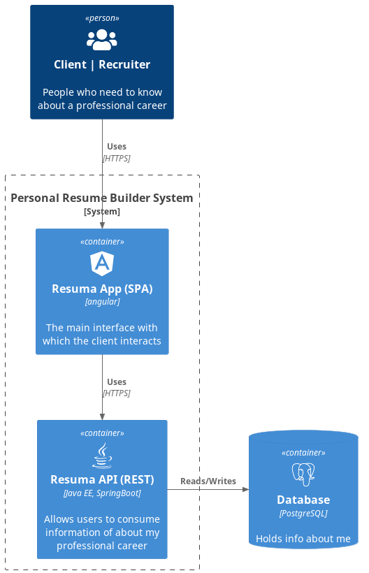

# :skull: Resume API :skull:

## :thought_balloon: What is it?

Resume-API is a REST API based on my career as a Software Engineer. 
You will have access to all the information about my work 
experiential and educational.



You can view all information about application here: [Wiki](https://github.com/untalsanders/resume-api/wiki)

## :question: How can I see or use it?

- You can view it via browser:

[https://untalsanders.github.io/resume](https://untalsanders.github.io/resume)

## :rocket: How to start?

- Install Java 17, go to [SDKMAN](https://sdkman.io/install) for install SDKMAN.

```shell
sdk install java x.y.z-vendor
```

- Set up JVM default 

```shell
export JAVA_HOME='$HOME/.sdkman/candidates/java/current'
```

- Clone this repository

```shell
git clone https://github.com/untalsanders/resume-api.git
```

- Run application

```shell
./gradlew bootRun
```

## :wolf: Author

- [Sanders Gutiérrez](https://untalsanders.github.io) - System Engineer (Java Developer)

## :unlock: License

This project is open-sourced software licensed under the [MIT licence](LICENSE). Created by [Sanders Gutiérrez](https://untalsanders.github.io).
